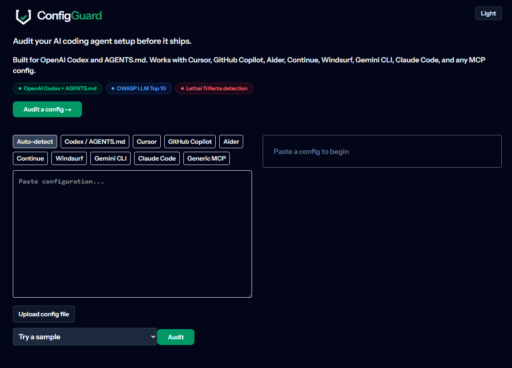

# ConfigGuard

https://config-guard-five.vercel.app/

ConfigGuard is built for OpenAI Codex and the AGENTS.md workflow, and it also audits other AI coding-agent configurations before they ship.

ConfigGuard is a browser-local scanner for AI agent configuration files.

You paste in things like AGENTS.md, Cursor rules, MCP configs, or Codex-style settings, and it checks for risky agent misconfigurations. It looks for problems like exposed secrets, unsafe shell or network access, webhook exfiltration, prompt leaks, KB poisoning, memory poisoning, unsafe scheduled tasks, plugin supply-chain risks, cloud metadata SSRF, IAM escalation, public sharing, and sensitive data in logs.

The main idea is simple:

Paste config -> Get security report -> See what is risky -> See why it matters -> Get a suggested fix

It runs in the browser, so the config does not need to leave the user’s machine. It is not a guarantee that an agent is safe, but it helps developers catch common high-risk patterns before shipping agent workflows.



## Supported agents

Codex, Cursor, GitHub Copilot, Aider, Continue, Windsurf, Gemini CLI, Claude Code, plus generic MCP configuration files.

## What it detects

ConfigGuard uses a deterministic client-side rule engine with 134 detection rules, with rule metadata informed by OWASP, NIST, CVEs, and agent security research. Codex and AGENTS.md are first-class inputs, with the same defensive checks applied to all supported agents. It also detects high-risk misconfigurations described in natural-language prose (for example AGENTS.md policy text), not only structured key-value settings.

ConfigGuard now detects sophisticated attack patterns including unsigned plugin supply-chain installs, cloud metadata SSRF exposure, prompt/system instruction disclosure, alert-routing hijack, public-link oversharing, trust-on-claim authorization flaws, unbounded access grants, log-based exfiltration channels, and reusable user-defined workflow abuse.

> ConfigGuard is a static analysis aid. It can produce false positives and false negatives. A clean scan does not guarantee that an agent is secure.

| Rule ID | Title | Severity |
|---|---|---|
| AGT-001..AGT-134 | Full catalog across trifecta, secrets, MCP, permissions, network, workflow, authorization, rate limiting, audit, data privacy, prompt injection, tool poisoning, memory, multi-agent, sandbox, supply chain, output handling, governance, CVE-specific checks, advanced natural-language detections, and multi-tool combo-chain checks | Critical, High, Medium, Low, Info |

Full canonical metadata is defined in `lib/rules/catalog.ts`.

## How it works

ConfigGuard parses pasted or uploaded configuration text in the browser, normalizes content using zod plus YAML and JSON parsing, and runs a deterministic rule engine. No backend, no API route, and no server-side data storage.

## Tech stack

- Next.js 15 + React 19 + TypeScript strict
- Tailwind CSS 4
- shadcn/ui primitives
- zod + yaml parsing
- Vitest + Testing Library

## Run locally

```bash
pnpm install
pnpm dev
```

## Deploy to Vercel

Push this repository to GitHub and import it in Vercel. The app is static-export capable (`output: 'export'`).

## Acknowledgments

- OWASP LLM Top 10 (2025)
- OWASP Top 10 for Agentic Applications (2026)
- Simon Willison lethal trifecta (June 16, 2025)
- Agents Rule of Two (Nov 2025)
- CVE-2025-6514, CVE-2025-54135, CVE-2025-54136

## Responsible use

ConfigGuard audits defensive misconfiguration patterns. Use only on configurations and systems you own or are authorized to assess.

ConfigGuard is not a replacement for security review, access review, threat modeling, or runtime monitoring.

## License

MIT (see `LICENSE`).
